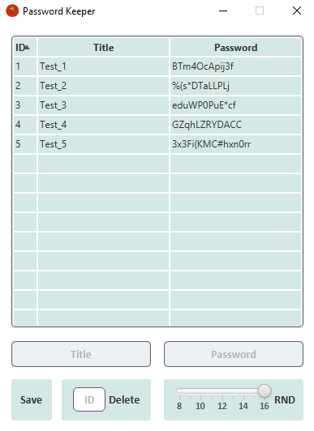

# PasswordKeeper

## GUI

## Idea

The basic idea is to keep all passwords in a custom password manager

## MVP Scope

As a user, I want to C.R.U.D. passwords. All passwords must be securely encrypted.

## How it works

Based on MVP Scope, we can specify next behaviors:

* User can create a new entry using a template (name, password)
* User can see already saved passwords
* User can update already saved passwords
* User can delete password by its ID
* User can log into the program through the PC username

## Technological stack

* SpringBoot as a skeleton framework
* JavaFX Weaver Starter
* JavaFX for GUI

## License

This project is Apache License 2.0 - see
the [LICENSE](https://github.com/VladyslavBabenko/PasswordKeeper/blob/master/LICENSE) file for details
